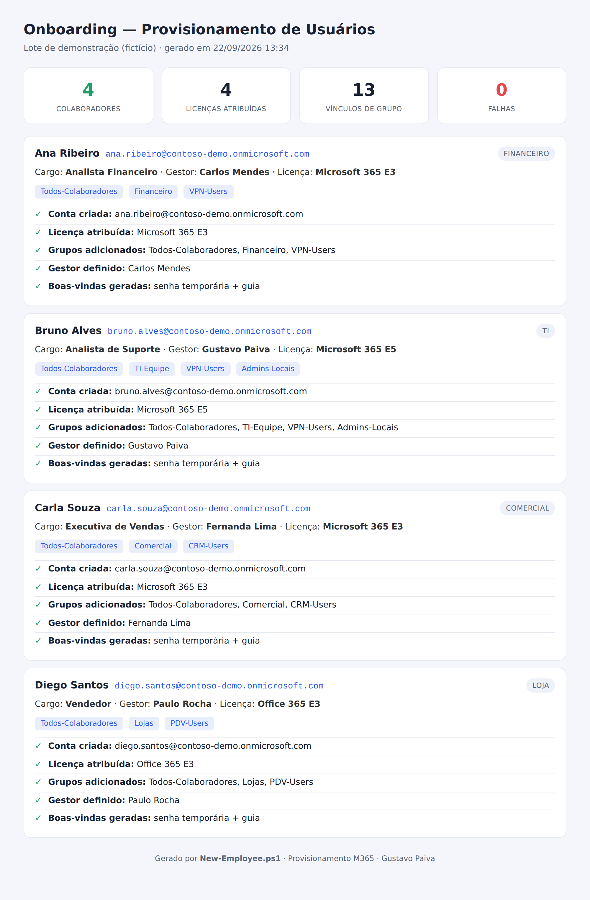

# Provisionamento de Usuários M365 — Onboarding & Offboarding

> Automatiza a entrada e a saída de colaboradores no Microsoft 365 (via Graph): cria a conta, atribui licença e grupos por cargo, define o gestor — e no desligamento revoga tudo.


---

## Problema

Cadastrar um novo colaborador na mão é lento e cheio de erro: criar a conta, lembrar qual licença dar, adicionar nos grupos certos, definir o gestor. E, pior, o **desligamento** costuma ser esquecido — a conta fica ativa e a licença continua sendo paga por alguém que já saiu (risco de segurança e desperdício de dinheiro).

## Solução

Dois scripts que padronizam o ciclo de vida do usuário, com provisionamento **baseado em cargo**:

- **`New-Employee.ps1`** (onboarding) — a partir do departamento, cria a conta, atribui a licença e os grupos definidos em `config/roles.json`, define o gestor, gera a senha temporária e produz um **relatório HTML** do que foi feito.
- **`Remove-Employee.ps1`** (offboarding) — desativa a conta, encerra as sessões, remove as licenças (economia imediata) e tira o usuário de todos os grupos.

Como o mapa cargo → licença + grupos fica num arquivo de configuração, o processo é consistente e à prova de esquecimento.

## Demonstração



> Lote de exemplo com 4 admissões. Cada colaborador recebeu automaticamente a licença e os grupos do seu cargo — TI ganhou Microsoft 365 E5, loja ganhou Office 365 E3 — sem nenhuma decisão manual.

## Stack

- **PowerShell 5.1 e 7**
- **Microsoft Graph** (`New-MgUser`, `Set-MgUserLicense`, `New-MgGroupMember`, `Set-MgUserManagerByRef`)
- Provisionamento baseado em cargo (JSON), relatório HTML autossuficiente

## Como usar

### Modo demonstração (sem tenant)

```powershell
git clone https://github.com/gustafpsdev/m365-user-provisioning.git
cd m365-user-provisioning

# Onboarding de um lote fictício -> gera o relatório
pwsh -File .\New-Employee.ps1 -DemoData
Invoke-Item .\output\onboarding-report.html

# Offboarding fictício
pwsh -File .\Remove-Employee.ps1 -DemoData
```

### Modo real (contra o seu tenant)

Requer o módulo Microsoft.Graph e permissões de administrador:

```powershell
Install-Module Microsoft.Graph -Scope CurrentUser

# Admitir um colaborador
./New-Employee.ps1 -Nome "Ana Ribeiro" -Departamento Financeiro -Cargo "Analista" -Gestor "Carlos Mendes"

# Desligar um colaborador
./Remove-Employee.ps1 -Upn ana.ribeiro@seudominio.com
```

Escopos usados (Graph): `User.ReadWrite.All`, `Group.ReadWrite.All`, `Organization.Read.All`, `Directory.ReadWrite.All`.

## Configuração por cargo

Todo o comportamento fica em `config/roles.json` — basta editar para o seu ambiente:

```json
"TI": {
  "licenca": "SPE_E5",
  "grupos": ["Todos-Colaboradores", "TI-Equipe", "VPN-Users", "Admins-Locais"]
}
```

Cada departamento define a licença (pelo `skuPartNumber`) e a lista de grupos. Departamentos não mapeados caem no `_default`.

## Aprendizados

- Criação e gestão de usuários e grupos via Microsoft Graph.
- Atribuição de licença por `skuPartNumber` e vínculo de gestor.
- Provisionamento baseado em cargo (padronização por configuração).
- Ciclo de vida completo do usuário: onboarding e offboarding, cobrindo segurança e custo.
- Compatibilidade entre Windows PowerShell 5.1 e PowerShell 7.

---

## Privacidade

O repositório usa **apenas colaboradores fictícios** (`data/demo-employees.json`) e um domínio de exemplo. Nenhuma pessoa real. No modo real, as senhas temporárias são geradas na hora e não são versionadas.

---

Feito por **Gustavo Paiva** · [LinkedIn](https://www.linkedin.com/in/gustavo-paiva-b38a22333)
